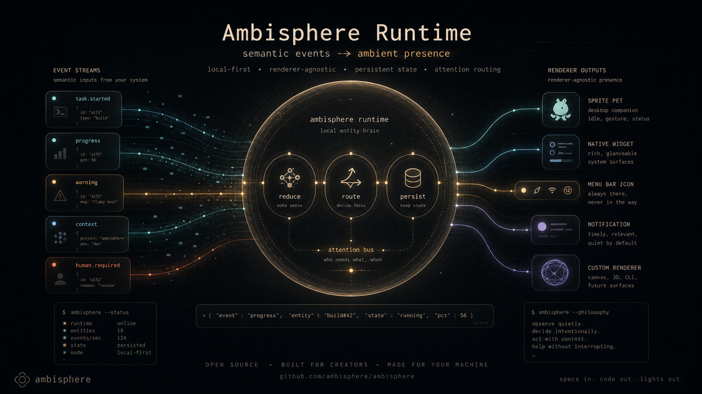

  

# Ambisphere Runtime

Ambisphere Runtime is an open ambient runtime for persistent entities, local agents, and operational presence.

The project explores a new interaction layer for agentic systems: calm, contextual, always-available interfaces that exist outside traditional application windows and chat surfaces.

Ambisphere entities are not limited to mascots or assistants. They are ambient operational interfaces capable of representing workflow state, orchestration systems, creative tooling, automation pipelines, local agents, and contextual presence.

The runtime is intended to support:

- Ambient desktop entities
- Persistent local presence
- Semantic event streams
- Persona-driven interfaces
- Operational and creative workflows
- Local-first and daemon-oriented architectures
- Cross-domain integrations
- Multiple rendering systems and interaction models

Potential use cases include:

- Storytelling and creative systems
- Workflow orchestration
- Software factories and CI systems
- Local AI tooling
- Educational interfaces
- Accessibility companions
- System observability
- Human-in-the-loop automation

Ambisphere is intentionally renderer-agnostic, platform-agnostic, and persona-agnostic.

The project begins with exploration, experimentation, and definition of the runtime concepts required for ambient entities to become a reusable interaction layer for future software systems.

## Status

Early concept and RFP stage.

The project is intentionally avoiding premature implementation constraints, framework lock-in, rendering assumptions, or protocol commitments until the runtime model and interaction philosophy are more fully explored.
