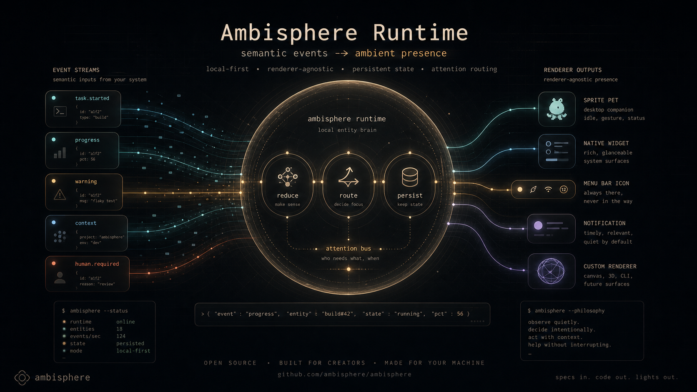

  

# Ambisphere Runtime

Ambisphere Runtime is an open ambient runtime for persistent entities, local agents, and operational presence.

The project explores a new interaction layer for agentic systems: calm, contextual, always-available interfaces that exist outside traditional application windows and chat surfaces.

Ambisphere entities are not limited to mascots or assistants. They are ambient operational interfaces capable of representing workflow state, orchestration systems, creative tooling, automation pipelines, local agents, and contextual presence.

The runtime is intended to support:

- Ambient desktop entities
- Persistent local presence
- Semantic event streams
- Persona-driven interfaces
- Operational and creative workflows
- Local-first and daemon-oriented architectures
- Cross-domain integrations
- Multiple rendering systems and interaction models

Potential use cases include:

- Storytelling and creative systems
- Workflow orchestration
- Software factories and CI systems
- Local AI tooling
- Educational interfaces
- Accessibility companions
- System observability
- Human-in-the-loop automation

Ambisphere is intentionally renderer-agnostic, platform-agnostic, and persona-agnostic.

## Architecture

The runtime model is now defined in **[ADR-0001](specs/drafts/ADR-0001-runtime-paradigm-and-language.md)** and a draft design-spec suite. In short:

- **Write side** — semantic events and actions arrive as addressed, capability-gated commands to per-entity mailboxes.
- **Source of truth** — a per-entity append-only **event log**; pure, deterministic reducers fold it into typed components.
- **Read side** — components form an **ECS-shaped materialized view** that renderers and the attention bus query. Nothing is written directly; components are derived and rebuildable from the log.
- **Edges** — renderers subscribe over a one-way observation contract (best language per platform); adapters translate external systems into the semantic event envelope (polyglot). The core daemon targets **Rust**.

The directionality invariant holds throughout: capability/actor semantics only on the write boundary, query semantics only on the read side, the log as the single seam. See the **[design spec index](specs/drafts/DESIGN-SPEC-INDEX.md)** for the full suite.

## Status

Design / specification stage.

The foundational paradigm and implementation language are decided and recorded in **[ADR-0001](specs/drafts/ADR-0001-runtime-paradigm-and-language.md)** (accepted): a capability-gated, actor-bounded write side over a per-entity append-only event log, with an ECS-shaped read-side materialized view. The core daemon targets Rust; renderers are best-per-platform; adapters are polyglot over a stable event envelope.

A full draft design-spec suite — ADR-0001 plus eleven component specs — is in review under [`specs/drafts/`](specs/drafts/). Start at the **[design spec index](specs/drafts/DESIGN-SPEC-INDEX.md)**.

The project continues to avoid premature implementation constraints beyond those recorded in ADR-0001; drafts clear review before code follows.

## Specs

- [Vision](specs/VISION.md) · [RFP](RFP.md) · [SRS](specs/SRS.md)
- [ADR-0001 — runtime paradigm + per-tier language](specs/drafts/ADR-0001-runtime-paradigm-and-language.md)
- [Design spec index](specs/drafts/DESIGN-SPEC-INDEX.md) — the full draft suite in dependency order
- Guidance & prior art: [paradigm + specs guidance](specs/drafts/runtime-paradigm-and-specs-guidance.md) · [implementation language](specs/drafts/implementation-language-guidance.md) · [actor-model prior art](specs/drafts/actor-model-prior-art.md) · [persona prior art](specs/drafts/persona-prior-art.md)
